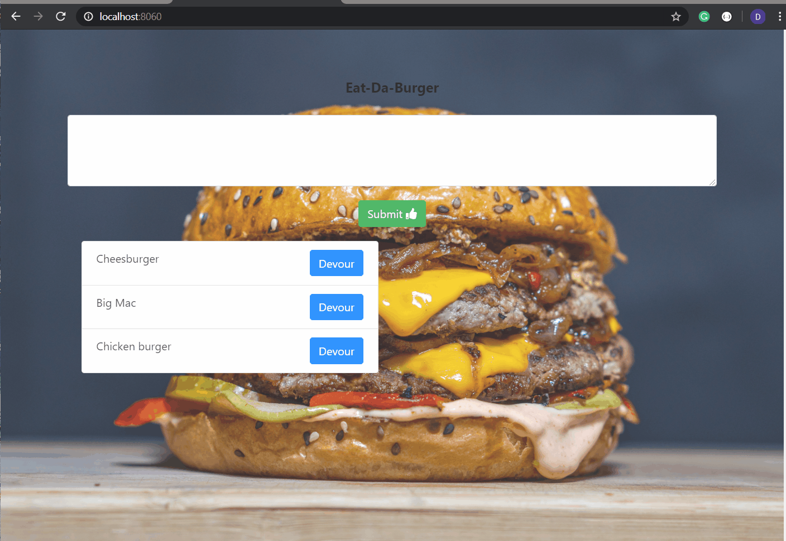

# Node_Express_Handlebars
This burger app lets you add burgers of your choice to the menu on the left side of the screen using input text area. Upon click on the submit button all of the desired burgers show on the screen with Devour button next to them. 
Once user is ready to eat chosen burgers, he or she can type devour and that will move chosen burgers to the right.
This application works dynamically utilizing MySql database of burgers. Whenever user inputs new burger it gets pushed to a Sql table. 

